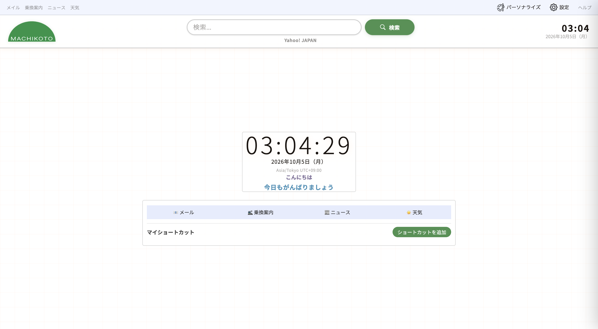
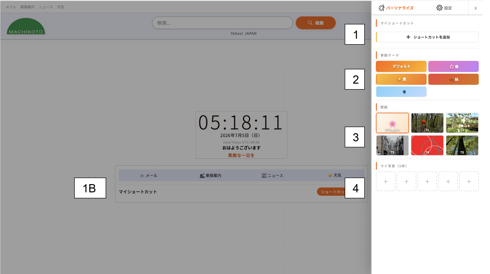
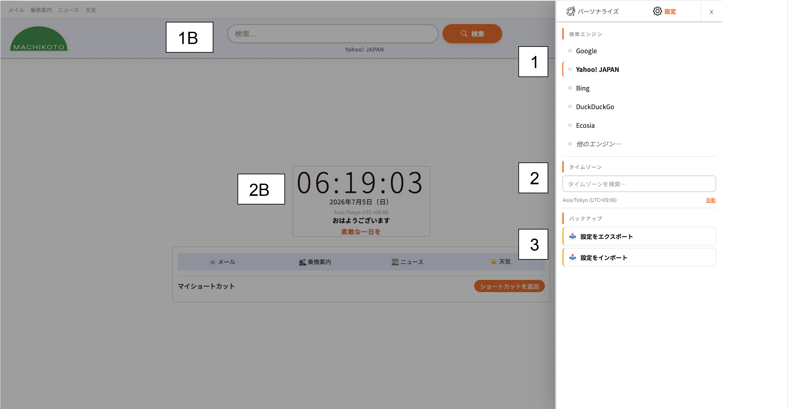

# Machikoto

[日本語](./README.ja.md) | [English](./README.en.md)

> *Ja - 「 日本語」: カスタマイズ可能なホームページ「MACHIKOTO」のご紹介*

># プロジェクトに関する重要なお知らせ：
>**誠に勝手ながら、Machikotoプロジェクトは個人的な理由（自身の個人プロジェクトに集中し、将来的により良くMachikotoを発展させるため）により、当面の間活動を休止させていただきます。この決定はプロジェクト自体に問題があったわけではなく、日本のユーザーの皆様から多大なる応援と愛をいただいたことに心より感謝しております。何卒ご理解のほどよろしくお願いいたします。なお、MACHIKOTOのトップページおよびヘルプページは今後もオンラインでアクセス可能な状態を維持し、閉鎖はいたしませんが、例外的な場合を除き、今後のアップデートは停止いたします。**

# プロジェクトの目的：
本プロジェクトは、当初「WAHOO! JAPAN」という名称でしたが、SOFTBANKの登録商標である「Yahoo! JAPAN」のブランドやサービスとユーザーが混同しないよう、「MACHIKOTO」に改名されました。その目的は、日本および世界中のユーザーに、自分の好みに合わせて完全にカスタマイズできるホームページを提供することです。既存のホームページの多くはカスタマイズができなかったり、あらかじめ用意されたフォントしか使えなかったりするため、そこに生活感と意味を持たせたいと考えました。MACHIKOTOをホームページに設定することで、追加したお気に入り、カスタム背景、および動的なシーズンテーマに簡単にアクセスできます。このテーマでは、特定の要素の色が変わるほか、季節に合わせた絵文字が降ってくるアニメーションが表示されます。最後に、このプロジェクトの最大の強みは、どの端末やブラウザを使っていても、同じカスタマイズ設定を維持して迷わず利用できる点にあります（もちろん、デバイスごとに個別に設定して異なる見た目にすることも可能です）。

# 機能一覧：

最上部のバーでは、様々な情報を確認できます。左側には、日々の生活に欠かせないツールとして厳選した、Yahoo! JAPANの「メール」「乗換案内」「ニュース」「天気」へのクイックアクセスショートカットが4つ用意されています。右側には、「パーソナライズ」と「設定」のボタンがあり、クリックするとそれぞれのドロップダウンメニューが開きます。

*パーソナライズ：*

1. 「+」アイコンをクリックすると、ホームページに独自のショートカットを追加でき、メインダッシュボードに表示されます。削除したい場合は、このメニューに戻り、削除したいショートカットの右側にある「X」をクリックします。
2. 4つのシーズンテーマに加え、アニメーションのないデフォルトのテーマから選択できます。4つの季節のいずれかを選択すると、背景にテーマに沿った絵文字が降り注ぎ、中央と右上にある2つの時計の色が選択したテーマに合わせて変化します。デフォルトテーマに設定されている場合は、背景色もそれに合わせて変化します。
3. あらかじめインストールされた5つの壁紙が用意されているほか、初回利用時のデフォルト壁紙もあります。ちなみに、テーマ「T1」はプロジェクトのロゴである「オレンジ」の画像になっています。
4. また、お好みの画像をアップロードできる空きスロットが5つ用意されており、スペースを空けたいときはいつでも削除できます。

*設定：*

1. 上部の検索バーで使用するお好みの検索エンジンを選択できます。デフォルトはGoogleですが、この例で使用しているYahoo! JAPAN（選択されると左側にオレンジ色のバーが表示され、名前が太字になります）、MicrosoftのBing、DuckDuckGo、Ecosiaなどから選択可能です。どれも当てはまらない場合は、「*他のエンジン…*」をクリックして指示に従うことで、カスタムエンジンを追加できます。
2. お住まいの地域に合わせてタイムゾーンを選択してください。日本国内にお住まいの場合は、デフォルトで「Asia/Tokyo」のタイムゾーンに設定されています。それ以外の場合は、世界中の利用可能な地域からタイムゾーンを選択できます。
3. 設定とパーソナライズの構成を、AからZまで完全に`.json`ファイル（JavaScriptで記述されたファイル）としてエクスポートできます。エクスポートオプションのすぐ下にあるインポートボタンを使用すれば、あらゆるブラウザ、デバイス、サポートに設定を読み込ませることができます。これは、特定のパラメータのリセット、キャッシュや内部ストレージのクリーンアップ、または新しい端末への移行を予定している場合に非常に便利です。

# ヘルプ：
詳細な情報、トラブルシューティング、ご質問、または改善のためのフィードバックやご提案がございましたら、上部メニューの「*ヘルプ*」をクリックするか、フッターにある「*❓ヘルプ*」をご覧ください。Machikotoの公式ヘルプウェブサイトにリダイレクトされます。

# 2番目のバー：
2番目のバーの左側にはMachikotoのロゴ、中央には検索バー（下にお好みの検索エンジンが表示されます）、端の右側には現在の時刻と日付が表示されます。

# 中央セクション：
メインのダッシュボードカードには、時刻、選択したタイムゾーン付きの日付、時間帯に応じた挨拶、および時間ごとに変わるその日の心温まるコメントが表示されます。
メインカードの下にはお気に入りセクションがあります。1行目には、左上のバーにあるものと同じ4つのショートカットが、今回は絵文字アイコン付きで直接画面に表示され、Yahoo! JAPANの「メール」「乗換案内」「ニュース」「天気」へ素早くアクセスできます。2行目には、「パーソナライズ」ドロップダウンパネルで設定したカスタムショートカットが表示されます。ホーム画面から直接これらを使用して、追加したお気に入りのウェブサイトに素早くアクセスできます。削除したい場合は、再度「パーソナライズ」メニューを開くだけです。ショートカットの枠数は無制限です。

# フッター：
フッターは、プロジェクトの今日までの歩みを示すテキストと、MACHIKOTOの利用規約およびプライバシー権で構成されています：
「*2025 - 20XX © Machikoto — あなたのプライバシーを尊重します。いつでもデフォルトに戻せます。詳細はこちら：*」
このメッセージは、規約を確認するか、サポートセクションの閲覧やお問い合わせメールアドレスが記載されているヘルプページ「*❓ヘルプ*」から、ご質問やご提案を送信することを促すものです。

**この度は、当方のGitHubリポジトリ、メインウェブページ、およびヘルプサイトをご覧いただき、誠にありがとうございました。また、このプロジェクトを信じ、支えてくださった日本のコミュニティの皆様をはじめ、すべての方々に深く感謝申し上げます。**

**感情、魔法、そして少しのノスタルジーを通じて、皆様に最高の体験をお届けできることを願っております！**

**MACHIKOTOは日本が大好きで、日本を応援しています！❤️**
